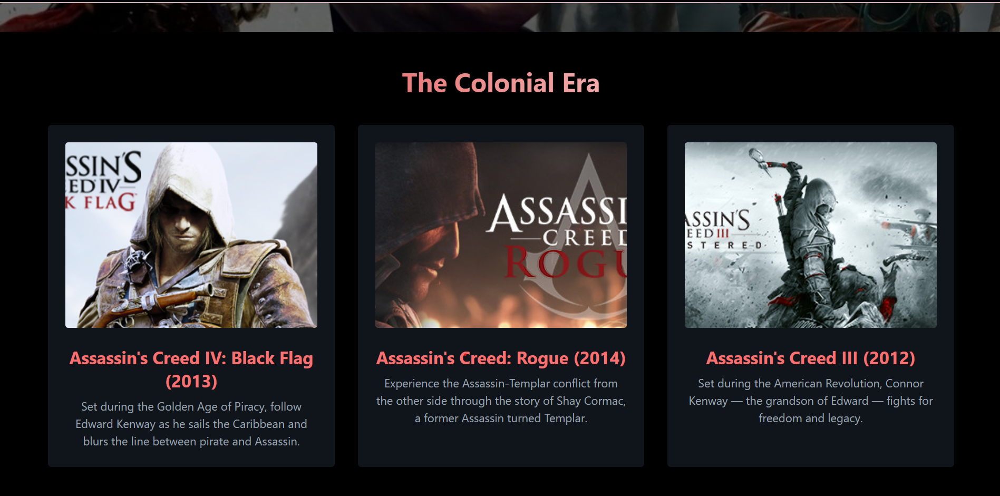

# 🗡️ Assassin's Creed Tribute Page

Welcome to the Assassin's Creed Tribute Page!
This fan-made website honors the legendary Assassin’s Creed franchise by **Ubisoft** — showcasing centuries of hidden blade warfare, historical exploration, and the eternal battle between Assassins and Templars. From ancient Egypt to Feudal Japan, this tribute captures the spirit, stories, and signature parkour stealth that define the Brotherhood.

## 📖 Description

This tribute website showcases every major Assassin's Creed title by dividing them into key narrative eras:

- The Desmond Saga (2007–2012)
- Colonial Era
- European Revolution Era
- Ancient Trilogy
- Modern Classic Return (Mirage & Shadows)

Each era includes individual game pages featuring banners, storylines, character highlights, trailers, and era-appropriate visuals. A special "Legendary Assassins" section is dedicated to iconic protagonists from all games.

## 🌐 Live Demo

[🔗 Visit the live site](https://divyansh3105.github.io/Assassins-Creed/)

## 🎮 Features

- 🕹️ Game Tributes
  Explore detailed tribute pages for each major Assassin's Creed game — from **AC (2007)** to **Assassin’s Creed Shadows (2024)**

- 🧍 Legendary Assassins
  Discover iconic characters like **Altair**, **Ezio**, **Connor**, **Edward Kenway**, **Arno**, **Bayek**, **Kassandra**, **Eivor**, **Basim**, and the newest — **Yasuke** & **Naoe**

- 🏛️ Organized Game Categories
  Titles are grouped into:
  - The Desmond Saga
  - Colonial Era
  - European Revolution Era
  - Ancient Trilogy
  - Modern Classic Return

- 📸 Visual Content
  Game banners, screenshots, trailers, and promotional art throughout the site

- 🧭 Smooth Navigation
  Fixed navbar with dropdown menus for quick access to any timeline or game

- 📱 Fully Responsive Design
  Works seamlessly across desktops, tablets, and mobile devices

## 🛠️ Technologies Used

- **HTML5** — for semantic markup and page structure
- **Tailwind CSS** — for utility-first modern styling
- **Bootstrap 4 & 5** — for grid layout, responsive design, and interactive components
- **Bootstrap Icons** — used for clean, minimal iconography
- **YouTube Embeds** — for official game trailers

## 📸 Screenshots

    
    
    

## License

This project is open-source and available under the MIT License.

## Author

**Divyansh Garg**

## Contact

- 📧 Email: divyanshgarg3105@gmail.com
- 🌐 GitHub: [GitHub Profile](https://github.com/Divyansh3105)

