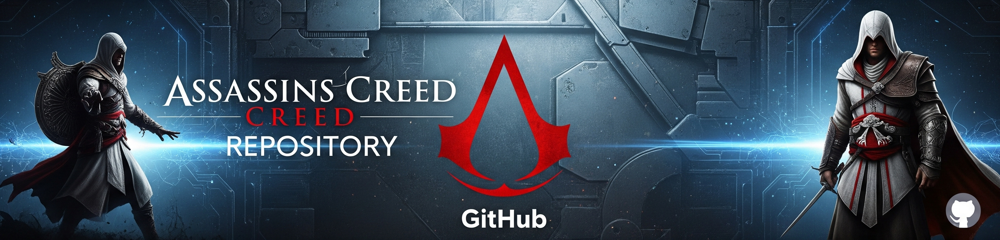
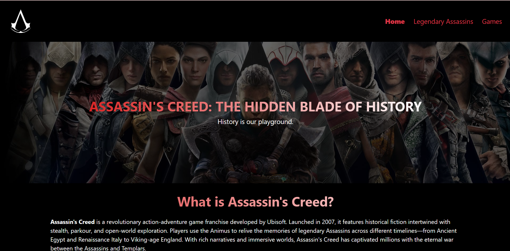
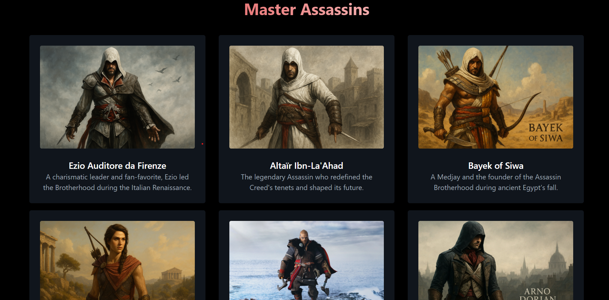

# 🗡️ Assassin's Creed Tribute Website




---


## 📌 Project Overview

The **Assassin’s Creed Tribute Website** is a fan-made project celebrating the **Assassin’s Creed franchise**.
It is built with **HTML & CSS**, focusing on **responsive layouts, animations, and clean design** to showcase the evolution of the series.

## 📖 Description

This website highlights the journey of **Assassins across centuries**, featuring:

- **The Desmond Saga** (AC1–AC3)
- **The Kenway Saga** (Black Flag, Rogue, AC3)
- **Ezio Trilogy** (AC2, Brotherhood, Revelations)
- **Industrial Revolution Titles** (Unity, Syndicate)
- **Ancient Trilogy** (Origins, Odyssey, Valhalla)

Each section has dedicated **tribute pages** with banners, characters, trailers, lore, and the Brotherhood’s creed.
A “**Legacy of the Assassins**” page pays homage to iconic Assassins across time.

🌐 **Live Demo:** [Assassin's Creed Tribute Website](https://assassins-creed-tribute.netlify.app)

💻 **GitHub Repo:** [Divyansh3105/Assassins-Creed](https://github.com/Divyansh3105/Assassins-Creed)

---

## 🚀 Features
- 🗡️ Tribute pages for multiple **Assassin’s Creed games**
- 📱 **Responsive design** – Works smoothly on desktop, tablet, and mobile
- 🧭 **Unified Navigation** – Consistent navbar and footer across pages
- 🎨 Pure **HTML + CSS styling** for modern and lightweight UI
- 🖼️ Engaging sections with banners, lore, and character highlights
- 🌍 Deployed seamlessly on **Netlify**

---

## 🛠️ Tech Stack
- **Frontend:** HTML5, CSS3
- **Deployment:** Netlify
- **Version Control:** Git & GitHub

---

## 📂 Project Structure
```
Assassins-Creed/
│── index.html                      # Landing page
│── styles.css                      # Landing page style
│── Assassins.html                  # Top Assassigns page
│── The Desmond Saga/               # Desmond Saga (AC1–AC3, Brotherhood, Revelations)
│── Modern Classic Return/          # Mirage, Shadows
│── European Revolution Era/        # Unity & Syndicate
│── Ancient Trilogy/                # Origins, Odyssey, Valhalla
│── Colonial Era/                   # BlackFlag, Rogue
│── Media/                          # Images, icons, and media
│── README.md                       # Project documentation
```

---

## 📸 Screenshots

### 🔹 Homepage


### 🔹 Game Page Example


---

## 📖 How to Run Locally

1. Clone the repository:
   ```bash
   git clone https://github.com/Divyansh3105/Assassins-Creed.git
   ```

2. Open the project folder:
   ```bash
   cd Assassins-Creed
   ```

3. Run the website:
   - Simply open `index.html` in your browser.

---

## 🎯 Purpose of the Project
This project was developed as a **portfolio showcase project** to:
- Practice **multi-page responsive design** using only HTML & CSS.
- Demonstrate ability to structure **content-rich tribute sites**.
- Present a visually engaging fan tribute to the **Assassin’s Creed universe**.
- Highlight creative storytelling combined with **modern web UI/UX practices**.

---

## 📌 Future Enhancements
- 🌑 Add **Dark/Light Mode toggle**
- 🎥 Integrate **trailers and gameplay clips**
- 🔎 Implement a **search/filter system** for games by timeline

---

## 👨‍💻 Author
**Divyansh Garg**
- 🌐 [Portfolio](https://divyansh3105.github.io/Portfolio/)
- 💼 [LinkedIn](www.linkedin.com/in/divyanshgarg3105)
- 💻 [GitHub](https://github.com/Divyansh3105)

---

✨ *This is a fan-made tribute website and not affiliated with Ubisoft or the official Assassin’s Creed franchise.*

⭐ If you like this project, consider giving it a **star** on GitHub!
