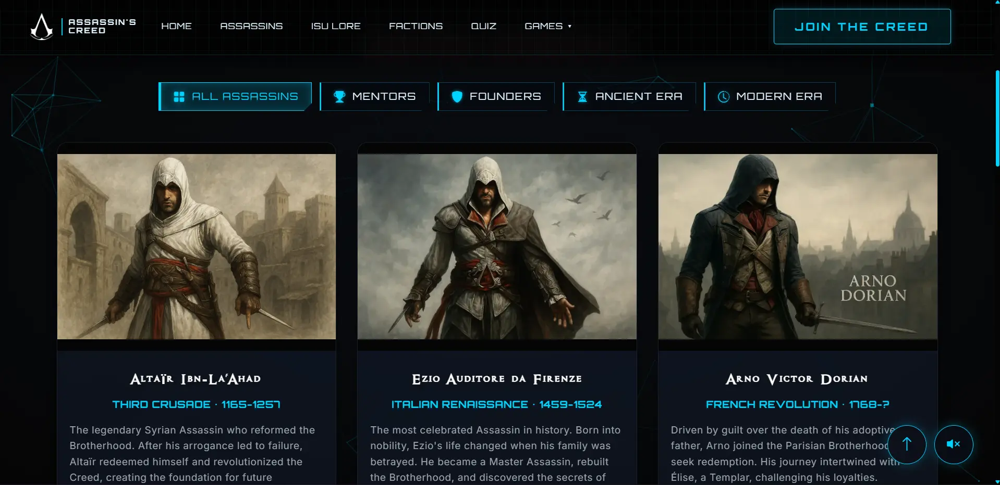
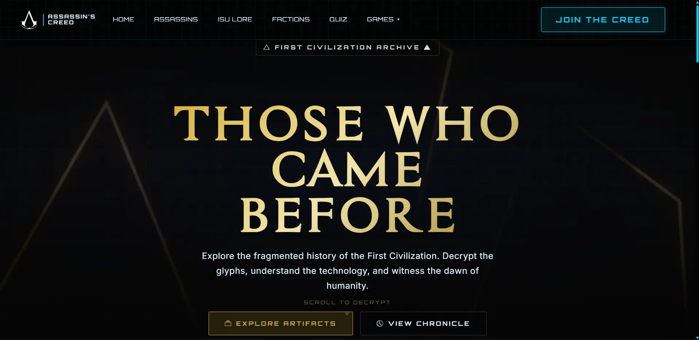

<div align="center">


# Assassin's Creed Tribute Website

_A visually immersive tribute website celebrating the Assassin’s Creed franchise, its iconic characters, and historical adventures._

[](https://assassins-creed-tribute.netlify.app/)
[](https://assassins-creed-tribute.netlify.app/)
[](https://assassins-creed-tribute.netlify.app/)
[](https://opensource.org/licenses/MIT)
[](https://assassins-creed-tribute.netlify.app/)

</div>

## 📖 Project Overview

The Assassin's Creed Tribute Website is an immersive, multi-page web experience that takes you through centuries of hidden history. Built with modern web technologies, it features stunning visuals, smooth animations, and interactive elements that bring the Assassin's Brotherhood to life. It is designed as a fan tribute for fans, developers, and students alike.

## 🚀 Live Demo

[](https://assassins-creed-tribute.netlify.app/)

## ✨ Features

|           Feature           | Description                                                          |
| :-------------------------: | :------------------------------------------------------------------- |
| **Particles.js Background** | - Dynamic animated particle effects creating an immersive atmosphere |
| **Background Music Player** | - Toggle-able ambient soundtrack with volume control                 |
|  **Scroll-to-Top Button**   | - Smooth scrolling navigation for better UX                          |
|     **Loading Screen**      | - Immersive "Synchronizing..." animation on page load                |
|    **Scroll Animations**    | - Intersection Observer API for smooth element reveals               |
|      **Tab Switching**      | - Interactive showcase of game styles (Stealth, Combat, Exploration) |
|     **Assassin Filter**     | - Filter legendary assassins by era, role, and attributes            |
|    **Animated Counters**    | - Dynamic statistics with smooth number animations                   |
|    **Dynamic Greetings**    | - Time-based welcome messages for personalized experience            |
|    **Parallax Effects**     | - Engaging scroll-based hero animations                              |
|       **Quiz System**       | - Interactive faction quizzes to test your knowledge                 |
|       **Isu Archive**       | - Deep lore exploration of the First Civilization                    |
|      **Faction Pages**      | - Detailed breakdown of the Assassin and Templar ideologies          |

## 🛠️ Tech Stack

| Category       | Technologies                                                                                                                                                                                    |
| :------------- | :---------------------------------------------------------------------------------------------------------------------------------------------------------------------------------------------- |
| **Markup**     |                                                                                                        |
| **Styling**    |                                                                                                           |
| **JS/Logic**   |   |
| **Tools**      |                                                                                |
| **Deployment** |                                                                                                  |

## 📁 Project Structure

```plaintext
├── css/                     # Stylesheets and modular CSS
├── data/                    # JSON data files for content
├── js/                      # JavaScript modules and logic
├── Media/                   # Images, audio, and visual assets
├── index.html               # Main entry point & Home page
├── Assassins.html           # Assassin roster and filters
├── era.html                 # Eras and timelines
├── factions.html            # Main Factions overview
├── factions_assassins.html  # Assassin Brotherhood deep-dive
├── factions_templars.html   # Templar Order deep-dive
├── game.html                # Interactive mini-events or showcases
├── isu.html                 # Isu lore archive
├── quiz_hub.html            # Faction quiz entry
├── quiz_results.html        # Quiz outcomes
├── robots.txt               # SEO bot rules
├── sitemap.xml              # SEO sitemap
├── LICENSE                  # MIT License
└── README.md                # Project documentation
```

## ⚙️ Installation & Setup

1. **Clone the repository:**

   ```bash
   git clone https://github.com/Divyansh3105/Assassins-Creed.git
   ```

2. **Navigate to the project directory:**

   ```bash
   cd Assassins-Creed
   ```

3. **Open with Live Server (or your preferred local server):**
   ```bash
   # If using VS Code, use the "Live Server" extension on index.html
   ```

> **Note:** Since this project relies on ES6 modules and fetch API calls for data loading, simply opening `index.html` from the file system (via `file://` protocol) might block cross-origin requests. Always use a local web server!

## 🎮 Usage

1. **Launch the site:** Start your local server and open the site in your browser.
2. **Experience the intro:** Wait for the "Synchronizing..." loading screen pattern to finish.
3. **Explore content sections:** Use the navigation menu to browse through assassins, eras, and Isu lore.
4. **Interact with the environment:** Toggle the background music player in the corner, test filters in the Assassins roster, and play around with the tabed showcases.
5. **Take the quiz:** Navigate to the quiz hub to discover where your loyalties lie.

## 🖼️ Screenshots / Demo

|                           Home / Hero Section                            |                           Factions Breakdown                           |
| :----------------------------------------------------------------------: | :--------------------------------------------------------------------: |
|   |     |
|                       **Assassins Roster Filter**                        |                            **Isu Archive**                             |
|  |  |

## 💡 What I Learned

- **Advanced CSS Animations:** Mastered scroll-driven parallax and smooth keyframe transitions.
- **Intersection Observer API:** Efficiently implemented scroll-triggered reveals without heavy performance hits.
- **Modular JavaScript:** Organized JS logic into ES6 imports/exports for maintainability throughout a multi-page site.
- **Performance Optimization:** Handled heavy assets (images, audio, particle effects) while maintaining smooth frame rates and fast local loading times.

## 🗺️ Future Improvements

- [ ] Add localization support (multi-language toggles)
- [ ] Implement a full-screen interactive timeline of events
- [ ] Optimize mobile viewport animations further
- [ ] Connect the Quiz System outcomes to a backend for global stats tracking

## 🤝 Contributing

Contributions are always welcome! How to contribute:

```bash
# 1. Fork the Project
# 2. Create your Feature Branch
git checkout -b feature/AmazingFeature

# 3. Commit your Changes
git commit -m "Add some AmazingFeature"

# 4. Push to the Branch
git push origin feature/AmazingFeature

# 5. Open a Pull Request
```

## ⚖️ License

This project is licensed under the MIT License - see the [LICENSE](LICENSE) file for details.

> **Disclaimer:** This project is an unofficial fan tribute. Assassin's Creed, its characters, logos, and related assets are trademarks and copyright of Ubisoft Entertainment. This website is for non-commercial, educational, and portfolio purposes only.

## 👨‍💻 About the Developer

<div align="center">

### Divyansh Garg

**Full-Stack Developer | Web Designer | AC Enthusiast**

[](https://divyansh3105.github.io/Portfolio/)
[](https://www.linkedin.com/in/divyanshgarg3105/)
[](https://github.com/Divyansh3105)

_🧠 Brain + 💻 Keyboard = ✨ Magic_

</div>

---

<div align="center">
  <i>"Nothing is true, everything is permitted."</i>

  <p>⭐ If you liked this tribute, please don't forget to star the repo!</p>
</div>
