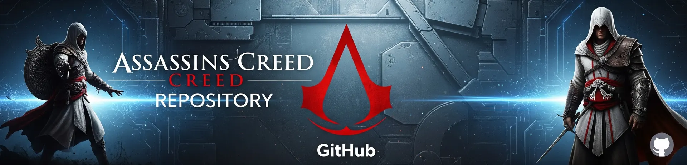
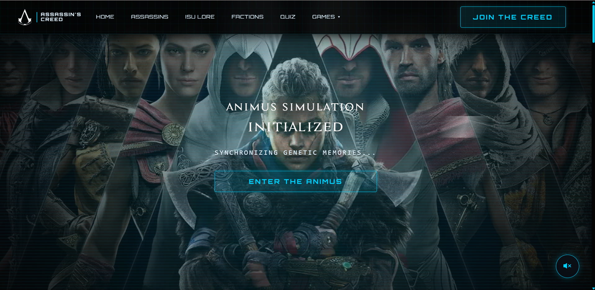
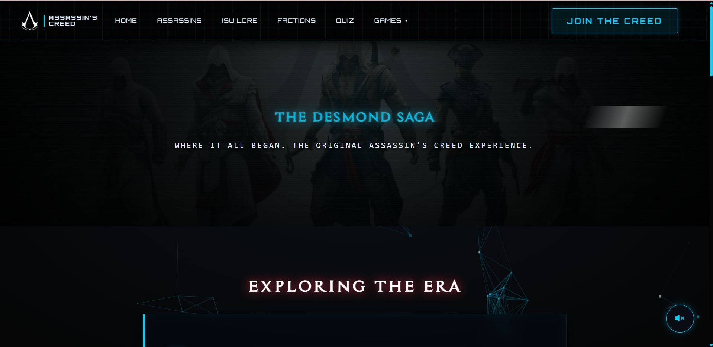

<div align="center">

# 🗡️ Assassin's Creed Tribute Website

### _Nothing is true, everything is permitted._



[](https://assassins-creed-tribute.netlify.app)
[](https://assassins-creed-tribute.netlify.app)
[](https://assassins-creed-tribute.netlify.app)
[](https://assassins-creed-tribute.netlify.app)
[](https://assassins-creed-tribute.netlify.app)

---

### 🌐 **[Live Demo](https://assassins-creed-tribute.netlify.app)** | 💻 **[GitHub Repo](https://github.com/Divyansh3105/Assassins-Creed)** | 👨‍💻 **[Portfolio](https://divyansh3105.github.io/Portfolio/)**

---


</div>

---

## 📌 Project Overview

> **A comprehensive fan-made tribute celebrating the legendary Assassin's Creed franchise**

The **Assassin's Creed Tribute Website** is an immersive, multi-page web experience that takes you through centuries of hidden history. Built with modern web technologies, it features stunning visuals, smooth animations, and interactive elements that bring the Assassin's Brotherhood to life.

<div align="center">

### 🎮 Spanning 2000+ Years of History | 🗡️ 13+ Main Titles | 🌍 5 Major Eras

</div>

## 📑 Table of Contents

- [📌 Project Overview](#-project-overview)
- [📦 What's Inside](#-whats-inside)
- [✨ Features Showcase](#-features-showcase)
- [🛠️ Tech Stack](#️-tech-stack)
- [📂 Project Structure](#-project-structure)
- [📸 Screenshots](#-screenshots)
- [🚀 Quick Start](#-quick-start)
- [🎮 Era Breakdown](#-era-breakdown)
- [🎯 Project Goals](#-project-goals)
- [🔮 Future Enhancements](#-future-enhancements)
- [👨‍💻 About the Developer](#-about-the-developer)

---

## 📦 What's Inside

This tribute website showcases the complete Assassin's Creed journey across five major eras:

<table>
<tr>
<td width="20%" align="center"><b>🏛️ The Desmond Saga</b></td>
<td width="80%">The original saga featuring <b>Altaïr, Ezio, Connor</b>, and <b>Desmond Miles</b> (AC1, AC2, Brotherhood, Revelations, AC3)</td>
</tr>
<tr>
<td width="20%" align="center"><b>⚓ Colonial Era</b></td>
<td width="80%">The legendary <b>Kenway family</b> across three generations featuring <b>Edward, Haytham, Connor</b>, and <b>Shay</b> (Black Flag, Rogue, AC3)</td>
</tr>
<tr>
<td width="20%" align="center"><b>🎩 European Revolution</b></td>
<td width="80%">Industrial Revolution chaos with <b>Arno Dorian</b> and the <b>Frye Twins</b> (Unity, Syndicate)</td>
</tr>
<tr>
<td width="20%" align="center"><b>⚔️ Ancient Trilogy</b></td>
<td width="80%">Epic RPG adventures with <b>Bayek, Kassandra/Alexios</b>, and <b>Eivor</b> (Origins, Odyssey, Valhalla)</td>
</tr>
<tr>
<td width="20%" align="center"><b>🌅 Modern Classic Return</b></td>
<td width="80%">Back to stealth roots with <b>Basim</b> and <b>Naoe & Yasuke</b> (Mirage, Shadows)</td>
</tr>
</table>

---

## ✨ Features Showcase

<div align="center">

### 🎯 Core Capabilities

</div>

```
🗡️  Multi-Page Architecture    📱  Fully Responsive Design    🧩  Modular Web Components
🎨  Modern UI/UX               🖼️  Rich Media Content         📊  Data-Driven JSON Rendering
```

<details>
<summary><b>🎮 Interactive Elements</b> (Click to expand)</summary>

<br>

| Feature                        | Description                                                        |
| ------------------------------ | ------------------------------------------------------------------ |
| ✨ **Particles.js Background** | Dynamic animated particle effects creating an immersive atmosphere |
| 🎵 **Background Music Player** | Toggle-able ambient soundtrack with volume control                 |
| 🔝 **Scroll-to-Top Button**    | Smooth scrolling navigation for better UX                          |
| 🎬 **Loading Screen**          | Immersive "Synchronizing..." animation on page load                |
| 🎯 **Scroll Animations**       | Intersection Observer API for smooth element reveals               |
| 🎨 **Tab Switching**           | Interactive showcase of game styles (Stealth, Combat, Exploration) |
| 🔍 **Assassin Filter**         | Filter legendary assassins by era, role, and attributes            |
| 📊 **Animated Counters**       | Dynamic statistics with smooth number animations                   |
| 🌅 **Dynamic Greetings**       | Time-based welcome messages for personalized experience            |
| 🎭 **Parallax Effects**        | Engaging scroll-based hero animations                              |
| 🧩 **Quiz System**             | Interactive faction quizzes to test your knowledge                 |
| 🧬 **Isu Archive**             | Deep lore exploration of the First Civilization                    |
| ⚔️ **Faction Pages**           | Detailed breakdown of the Assassin and Templar ideologies          |

</details>

<details>
<summary><b>🎨 Design Features</b> (Click to expand)</summary>

<br>

- 🎨 **Custom Assassin's Creed Font** – Authentic typography from the game
- 🌑 **Dark Theme** – Immersive black and red color scheme
- ✨ **Glowing Text Effects** – Animated gradient headings with pulsing glow
- 🎯 **Custom Cursor** – Themed pointer design for enhanced immersion
- 📜 **Custom Scrollbar** – Styled with signature Assassin's Creed red
- 💫 **Hover Animations** – Interactive card and button effects on mouse over
- 🎪 **Staggered Animations** – Sequential element reveals for visual appeal
- 🔴 **Gradient Accents** – Smooth red-to-white color transitions
- 🖼️ **High-Quality Images** – Optimized game banners and character portraits
- 🎬 **Smooth Transitions** – CSS animations for seamless user experience

</details>

<details>
<summary><b>🧭 Navigation Features</b> (Click to expand)</summary>

<br>

| Feature           | Desktop             | Mobile          |
| ----------------- | ------------------- | --------------- |
| **Menu Style**    | Horizontal navbar   | Hamburger menu  |
| **Dropdown**      | Hover-activated     | Touch-activated |
| **Transitions**   | Smooth fade         | Slide & fade    |
| **Active Links**  | Highlighted         | Highlighted     |
| **Accessibility** | Keyboard navigation | Touch-friendly  |

</details>

---

## 🛠️ Tech Stack

<div align="center">

| Category            | Technologies                             |
| ------------------- | ---------------------------------------- |
| **Frontend**        | HTML5 (Semantic), CSS3 (Variables), ES6+ |
| **Architecture**    | Web Components API, Vanilla JSON Fetch   |
| **SEO & Discovery** | Semantic HTML, Sitemap.xml, Robots.txt   |
| **Libraries**       | Particles.js, Bootstrap Icons            |
| **Animations**      | CSS Keyframes, Intersection Observer API |
| **Deployment**      | Netlify (CI/CD)                          |
| **Version Control** | Git & GitHub                             |

</div>

---

## 📂 Project Structure

```text
Assassins-Creed/
│
├── index.html                   # Landing page with hero, about, game styles, stats
├── Assassins.html               # Data-driven Legendary Assassins showcase
├── era.html                     # Era-specific pages
├── game.html                    # Game-specific pages
├── 404.html                     # Custom error page
├── factions.html                # Factions landing page
├── factions_assassins.html      # Assassins faction details
├── factions_templars.html       # Templars faction details
├── isu.html                     # The Isu legacy page
├── quiz_hub.html                # Quiz hub page
├── quiz_results.html            # Quiz results page
├── robots.txt                   # Search engine crawler instructions
├── sitemap.xml                  # Website sitemap for SEO
│
├── 📁 css/                         # Modular stylesheets
│   ├── base.css                    # CSS Variables, resets, and typography
│   ├── layout.css                  # Grids, utility classes, and responsive logic
│   ├── components.css              # Custom Web Components styling
│   ├── styles.css                  # Primary page styles and animations
│   ├── styles_era.css              # Era-specific page styling
│   ├── styles_game.css             # Game-specific page styling
│   ├── factions_shared.css         # Shared styles for Factions pages
│   ├── factions_assassins.css      # Assassin-specific variables and overrides
│   ├── factions_templars.css       # Templar-specific variables and overrides
│   ├── factions.css                # Factions landing page styles
│   ├── isu.css                     # Isu page styling
│   └── quiz.css                    # Quiz pages styling
│
├── 📁 js/                          # Core scripts
│   ├── app.js                      # Asynchronous JSON data fetching and DOM hydration
│   ├── components.js               # Reusable Web Components (Header, Footer, Loaders)
│   └── script.js                   # UI animations, observers, and event listeners
│
├── 📁 data/
│   ├── particles-config.json       # Particles.js configuration
│   └── data.json                   # Centralized payload for assassins, games, and eras
│
├── 📁 Media/                       # All images, fonts, and audio
│   ├── 🖼️ *.webp,             # Game banners, character images, heroes
│   ├── 🔤 Assassin.ttf            # Custom Assassin's Creed font
│   ├── 🎵 background.mp3           # Background music
│   ├── 🎨 logo.png                 # AC logo
│   └── 🖱️ Unavailable.cur          # Custom cursor
│
├── 📄 LICENSE                      # MIT License
└── 📄 README.md                    # This file
```

---

## 📸 Screenshots

<div align="center">

### 🏠 Homepage



_Featuring hero banner, about section, game styles showcase, and franchise statistics_

---

### 🎮 Game Page



_Individual game pages with detailed information, characters, and historical context_

</div>

---

## 🚀 Quick Start

### Prerequisites

- A modern web browser (Chrome, Firefox, Safari, Edge)
- Optional: Local server for optimal performance

### Installation

```bash
# 1. Clone the repository
git clone https://github.com/Divyansh3105/Assassins-Creed.git

# 2. Navigate to project directory
cd Assassins-Creed

# 3. Open in browser
# Simply double-click index.html or use a local server:
```

### Running with Local Server (Recommended)

<details>
<summary><b>Option 1: Python</b></summary>

```bash
# Python 3
python -m http.server 8000

# Python 2
python -m SimpleHTTPServer 8000

# Then open: http://localhost:8000
```

</details>

<details>
<summary><b>Option 2: Node.js</b></summary>

```bash
# Using http-server
npx http-server

# Or install globally
npm install -g http-server
http-server

# Then open: http://localhost:8080
```

</details>

<details>
<summary><b>Option 3: VS Code Live Server</b></summary>

1. Install "Live Server" extension in VS Code
2. Right-click `index.html`
3. Select "Open with Live Server"
4. Browser opens automatically
</details>

---

## 🎮 Era Breakdown

<div align="center">

### 🏛️ The Desmond Saga

_Where it all began_

</div>

| Game                 | Year | Protagonist        | Era                             | Location         |
| -------------------- | ---- | ------------------ | ------------------------------- | ---------------- |
| Assassin's Creed     | 2007 | Altaïr Ibn-La'Ahad | Third Crusade (1191)            | Holy Land        |
| Assassin's Creed II  | 2009 | Ezio Auditore      | Italian Renaissance (1476-1499) | Italy            |
| AC: Brotherhood      | 2010 | Ezio Auditore      | Renaissance Rome (1500-1507)    | Rome             |
| AC: Revelations      | 2011 | Ezio & Altaïr      | Ottoman Empire (1511-1512)      | Constantinople   |
| Assassin's Creed III | 2012 | Connor Kenway      | American Revolution (1754-1783) | Colonial America |

<div align="center">

### ⚓ Colonial Era / The Kenway Saga

_Three generations, one legendary bloodline_

</div>

| Game                 | Year | Protagonist   | Era                              | Location         |
| -------------------- | ---- | ------------- | -------------------------------- | ---------------- |
| AC IV: Black Flag    | 2013 | Edward Kenway | Golden Age of Piracy (1715-1722) | Caribbean        |
| AC: Rogue            | 2014 | Shay Cormac   | Seven Years' War (1752-1761)     | North Atlantic   |
| Assassin's Creed III | 2012 | Connor Kenway | American Revolution (1754-1783)  | Colonial America |

<div align="center">

### 🎩 European Revolution Era

_Revolution and industrial change_

</div>

| Game          | Year | Protagonist       | Era                           | Location |
| ------------- | ---- | ----------------- | ----------------------------- | -------- |
| AC: Unity     | 2014 | Arno Dorian       | French Revolution (1789-1794) | Paris    |
| AC: Syndicate | 2015 | Jacob & Evie Frye | Victorian Era (1868)          | London   |

<div align="center">

### ⚔️ Ancient Trilogy

_Massive RPG experiences in ancient worlds_

</div>

| Game         | Year | Protagonist        | Era                          | Location |
| ------------ | ---- | ------------------ | ---------------------------- | -------- |
| AC: Origins  | 2017 | Bayek of Siwa      | Ptolemaic Egypt (49-43 BCE)  | Egypt    |
| AC: Odyssey  | 2018 | Kassandra/Alexios  | Ancient Greece (431-422 BCE) | Greece   |
| AC: Valhalla | 2020 | Eivor Varinsdottir | Viking Age (873-878 CE)      | England  |

<div align="center">

### 🌅 Modern Classic Return

_Back to stealth roots_

</div>

| Game        | Year | Protagonist     | Era                        | Location |
| ----------- | ---- | --------------- | -------------------------- | -------- |
| AC: Mirage  | 2023 | Basim Ibn Ishaq | Abbasid Caliphate (861 CE) | Baghdad  |
| AC: Shadows | 2025 | Naoe & Yasuke   | Feudal Japan (1579 CE)     | Japan    |

---

## 🎯 Project Goals

<div align="center">

This project was crafted to demonstrate:

</div>

```
✅ Multi-page responsive web design
✅ Advanced CSS animations and transitions
✅ JavaScript DOM manipulation and event handling
✅ Intersection Observer API implementation
✅ Accessibility best practices
✅ Performance optimization techniques
✅ Clean, maintainable code structure
✅ Creative storytelling through web design
```

---

## 🔮 Future Enhancements

<table>
<tr>
<td width="50%">

### 🎨 Design & UX

- [ ] Dark/Light mode toggle
- [ ] Theme customization options
- [ ] Advanced parallax effects
- [ ] 3D card flip animations
- [ ] Custom loading animations per era

</td>
<td width="50%">

### ⚡ Features

- [ ] Embedded game trailers
- [ ] Character comparison tool
- [ ] Interactive timeline
- [ ] Search functionality
- [ ] Franchise statistics dashboard

</td>
</tr>
<tr>
<td width="50%">

### 🌐 Technical

- [ ] Progressive Web App (PWA)
- [ ] Multi-language support
- [ ] Backend integration
- [ ] User accounts & favorites
- [ ] Performance analytics

</td>
<td width="50%">

### 📱 Content

- [ ] News section for updates
- [ ] Community fan art gallery
- [ ] Game reviews & ratings
- [ ] Easter eggs & secrets guide
- [ ] Lore deep-dive articles

</td>
</tr>
</table>

---

## 👨‍💻 About the Developer

<div align="center">

### Divyansh Garg

**Full-Stack Developer | Web Designer | AC Enthusiast**

[](https://divyansh3105.github.io/Portfolio/)
[](https://www.linkedin.com/in/divyanshgarg3105/)
[](https://github.com/Divyansh3105)

_🧠 Brain + 💻 Keyboard = ✨ Magic_

</div>

---

## 📄 License

This project is licensed under the **MIT License** - see the [LICENSE](LICENSE) file for details.

---

## 🙏 Acknowledgments

<div align="center">

Special thanks to:

**🎮 Ubisoft** - For creating the legendary Assassin's Creed franchise

**✨ Particles.js** - For the mesmerizing background effects

**🎨 Bootstrap Icons** - For the comprehensive icon library

**🌐 Netlify** - For seamless hosting and deployment

**❤️ AC Community** - For endless inspiration and passion

</div>

---

## 📊 Project Stats

<div align="center">


</div>

---

<div align="center">

## 💬 Feedback & Contributions

Found a bug? Have a suggestion? Want to contribute?

**Feel free to open an issue or submit a pull request!**

---

### ⭐ If you enjoyed this project, please give it a star!

---


### _"Nothing is true, everything is permitted."_

**🗡️ May the Father of Understanding guide you 🗡️**

---

**Made with ❤️ and ☕ by [Divyansh Garg](https://github.com/Divyansh3105)**

_This is a fan-made tribute website and is not affiliated with Ubisoft or the official Assassin's Creed franchise._

</div>
